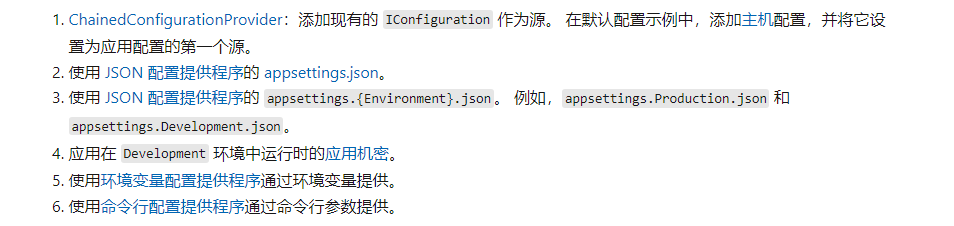

---
presentation:
    theme: night.css
---

<!-- slide -->
##  Configuration In netcore

<!-- slide -->
* Configuration
* Resource
* Setting
　
<!-- slide -->
* File
* Environment
* Application Arguments
* Database
* Third Part Configuration System
* Memory Object

<!-- slide -->
### Demo1 - Basic Configuration

<!-- slide -->
## Demo2 - Multi Provider

<!-- slide -->
## Default Configuration in netcore

- 
- 
[Link](https://docs.microsoft.com/zh-cn/aspnet/core/fundamentals/configuration/?view=aspnetcore-6.0)

<!-- slide -->
## Options
> The options pattern uses classes to provide strongly typed access to groups of related settings

<!-- slide -->
### Demo3 - Basic Options

<!-- slide -->
* IOptions<TOptions>
* IOptionsSnapshot<TOptions>
* IOptionsMonitor<TOptions>

<!-- slide -->
### Demo4 - Complex Options 

<!-- slide -->
* IConfigureNamedOptions
* IValidateOptions
* IPostConfigureOptions<TOptions>

<!-- slide -->
### Demo5 Knife version

<!-- slide -->
## Thank You